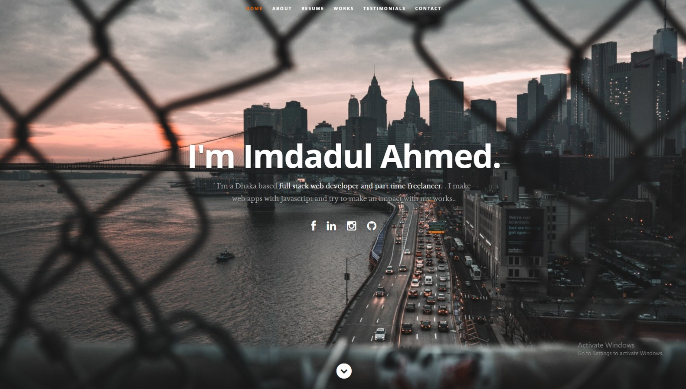

## Portfolio of Imdadul Ahmed

Passionate Software Engineer with a background in Nuclear Engineering (Bachelors) and Business Administration (Masters), backed by a bootcamp certification. Eager to bring my unique blend of technical skills and strategic thinking to a dynamic role. Committed to driving innovation and efficiency, I aim to contribute meaningfully to projects and embrace the challenges of the ever-evolving software development landscape.

### Check out my portfolio: [https://ahmedimdad93.netlify.app](https://ahmedimdad93.netlify.app/)

### Download Resume: [Drive link here](https://drive.google.com/file/d/1_IXevhEB3jwBzlxtv7exDOiZMph97IZ7/view?usp=sharing)
